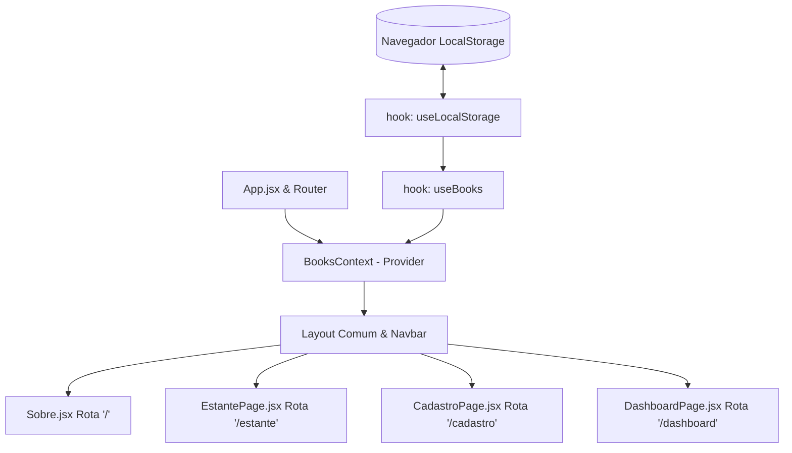

# Arquitetura do Sistema e Fluxo de Dados 🏗️

Este documento detalha o design arquitetural, o gerenciamento de estado global e as rotas do **Libris**.

---

## 1. Visão Geral da Arquitetura

O Libris é uma aplicação Single Page Application (SPA) baseada em React e estruturada para modularidade e separação de responsabilidades. O sistema utiliza roteamento dinâmico no lado do cliente e persistência no LocalStorage do navegador.

A arquitetura segue o seguinte fluxo de componentes e estado:

---

## 2. Gerenciamento de Estado (React Context API)

Para evitar o acoplamento excessivo e a técnica de *prop drilling*, a aplicação utiliza o `BooksContext`. Ele encapsula as regras de negócio de manipulação de dados e expõe as ações de CRUD.

### Provedor de Dados (`BooksProvider` em `src/context/BooksContext.jsx`)
* **Consumo simplificado**: Expõe o hook `useBooksContext()` que valida se o componente consumidor está dentro do escopo do provedor.
* **Propriedades expostas**:
  * `books`: Array bruto contendo todos os objetos `Livro`.
  * `adicionarLivro(dados)`: Função para validar, criar e persistir um livro.
  * `atualizarLivro(id, novosDados)`: Função para alterar propriedades de um livro existente.
  * `removerLivro(id)`: Remove o registro da lista.
  * `buscarLivroPorId(id)`: Retorna o objeto do livro correspondente.
  * `metrics`: Objeto memoizado com contadores globais (taxa de conclusão, mídias por tipo, etc.).

---

## 3. Roteamento (`react-router-dom`)

O roteador está configurado no `src/App.jsx` utilizando o componente `<BrowserRouter>`.

### Rotas Disponíveis

1. **`/` (Landing Page)**: 
   * Renderiza a página `Sobre.jsx`.
   * **Particularidade**: A barra de navegação global (`Navbar`) é ocultada nesta rota específica para focar a experiência na entrada do site.
2. **`/dashboard` (Painel Analítico)**: 
   * Renderiza `DashboardPage.jsx`, que consome os dados do contexto e renderiza o componente `<Dashboard />`.
3. **`/estante` (Minha Estante)**: 
   * Renderiza `EstantePage.jsx`, contendo a tabela `<BookTable />` e controles de busca, filtros rápidos e ordenação. A edição é reativa e ocorre localmente através de um modal nesta página.
4. **`/cadastro` (Cadastro de Livros)**: 
   * Renderiza `CadastroPage.jsx`. Após salvar com sucesso, dispara o redirecionamento automático via `useNavigate()` para a rota `/estante`.

---

## 4. Persistência (`src/hooks/useLocalStorage.js`)

A persistência é encapsulada em um hook genérico customizado chamado `useLocalStorage`.
* Ele se comporta de forma idêntica ao `useState` tradicional do React, porém sincroniza qualquer alteração de estado diretamente com a chave correspondente no `localStorage` do navegador.
* Contém tratamento de erros para prevenir falhas de parsing ou escrita no armazenamento local.
